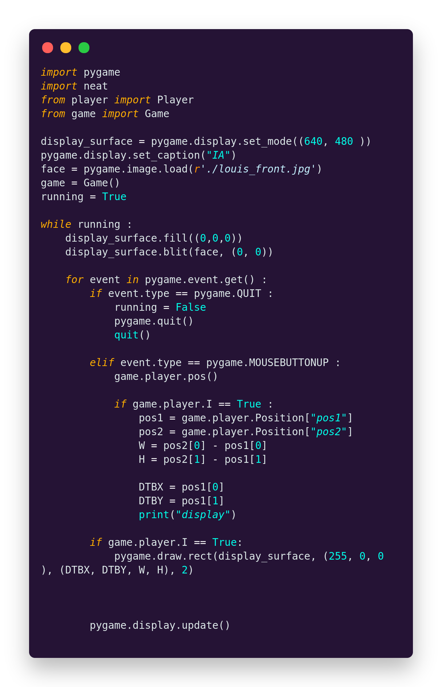
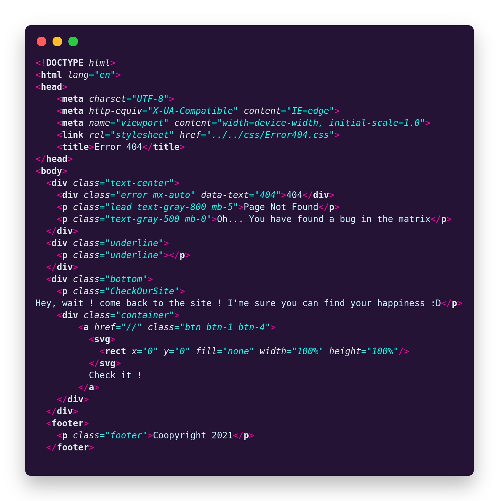
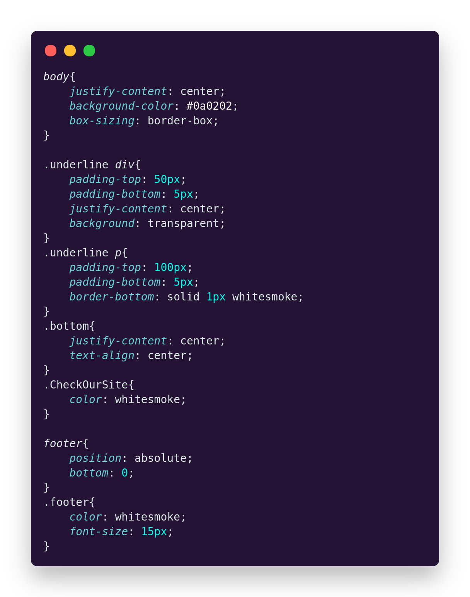
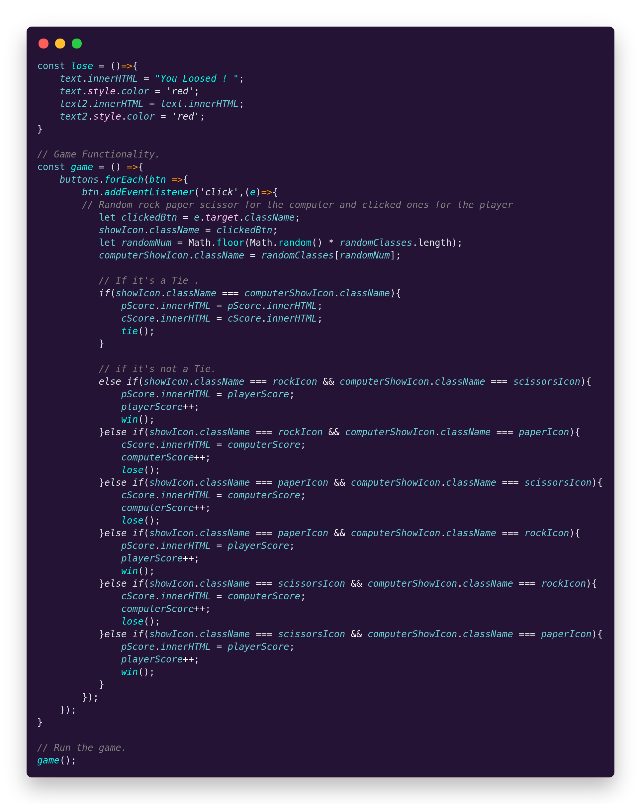

    

    N-Dark Theme,  
    with some beautiful colors, creates the... Hmm... I don't remember it... Anyway, 
    It's a perfect theme for you ! 
    </strong>Test it and enjoy it ! (it's free so... DON'T WAIT !)</strong>

    

        Here u have some screenshot of code with the theme:
    

//PYTHON
    

        

            PYT
        

        
    

//HTML
    

        

            HTML
        

        
    

//CSS
    

        

            HTML
        

        
    

//C
    

        

            C
        

        
    

//JS
    

        

            JS
        

        
    

    <a href="https://marketplace.visualstudio.com/items?itemName=Akako.z-darktheme">
    <strong>Test also the Z-DarkTheme !</strong>
    </a>

